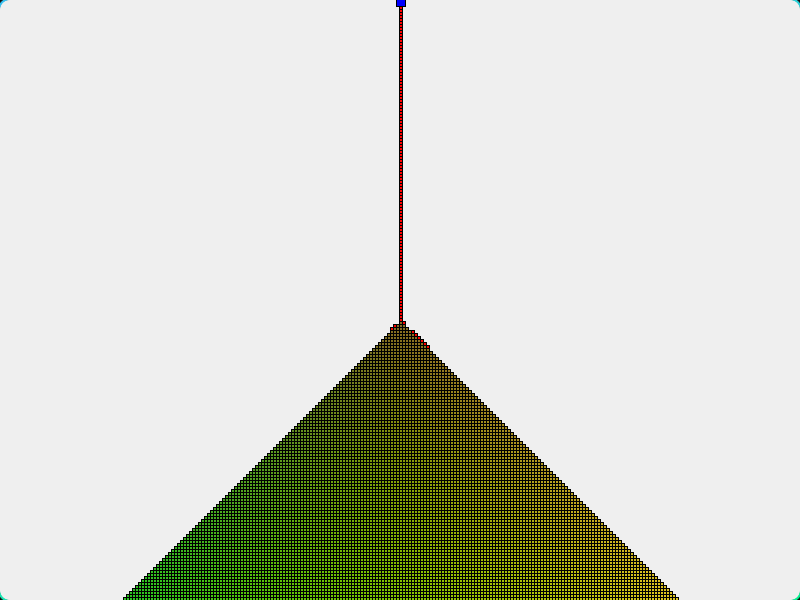

# sandsim

A falling-sand simulation in C++23 and Qt6.



Grains spawn from a cursor at the top of the window. Each step a grain moves
straight down if the cell below is free, otherwise diagonally down-left or
down-right, otherwise it comes to rest. Resting grains are drawn once into a
background image and dropped from the simulation, so the cost per frame stays
flat no matter how full the grid gets.

## Build

```sh
cmake -S . -B build
cmake --build build
./build/sandsim
```

Requires Qt6 Widgets and a compiler with C++23 support.

## Controls

Left and right arrow keys move the spawn point.

## License

MIT, see [LICENSE](LICENSE).
